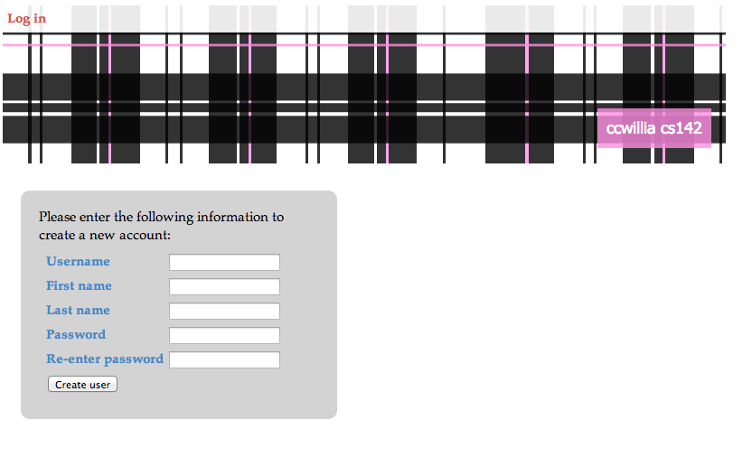
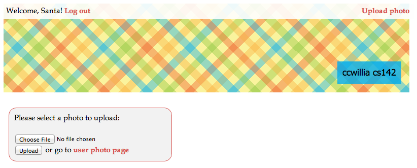
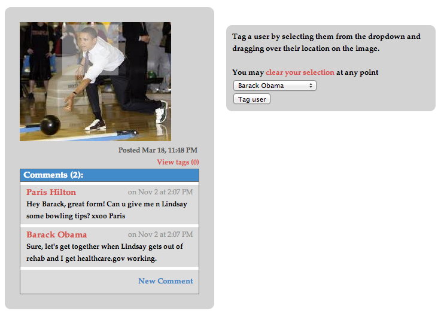
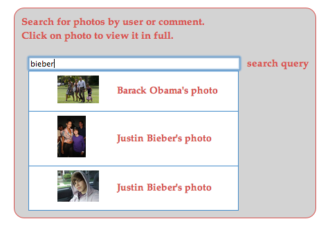

###Web applications quarter-long project: 
MVC / Rails implementation of photo sharing website
Ruby  2.0.0
Rails 4.0.0
sqlite3

###Features:
####user login/accounts

####password verification, password hashing/salting, sessions

####photo uploading, photo comments

####JavaScript-based photo tagging (`../photos/:id/tags/`)

####AJAX-based live search (`../users/`)

####RESTful routing 

